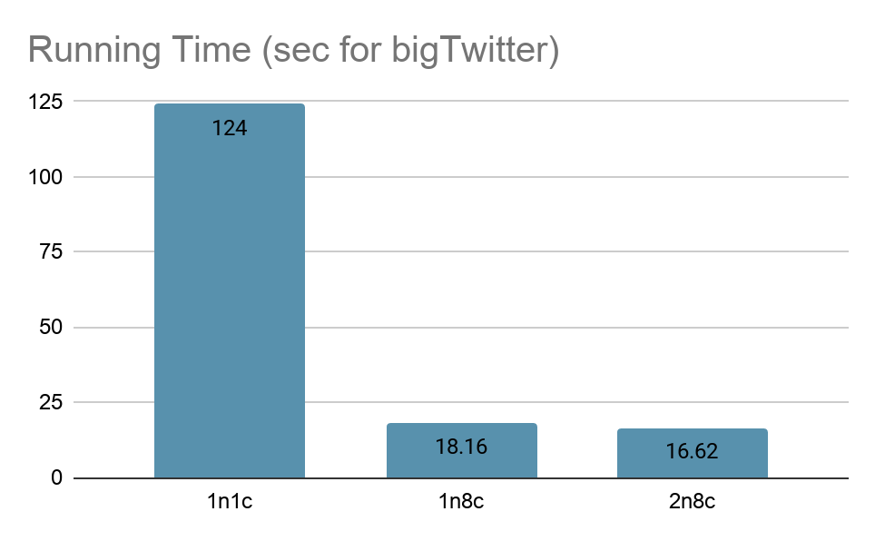

## COMP90024_Assignment1

### Dependency

1) Test Platform:

* SPARTAN cluster (University of Melbourne HPC)

2) Dependency:

* Python3.7
* mpi4py

3) Dataset/Files:

* bigTwitter.json / smallTwitter.json
* melbGrid.json
* AFINN.txt

### How to Run

Windows

```bash
mpiexec -n 8 python a6.py --grid_file melbGrid.json --twitter_file smallTwitter.json --score_file AFINN.txt
```

Linux/MacOS

```bash
mpirun -np 8 python3 a6.py --grid_file melbGrid.json --twitter_file smallTwitter.json --score_file AFINN.txt
```

### Result

